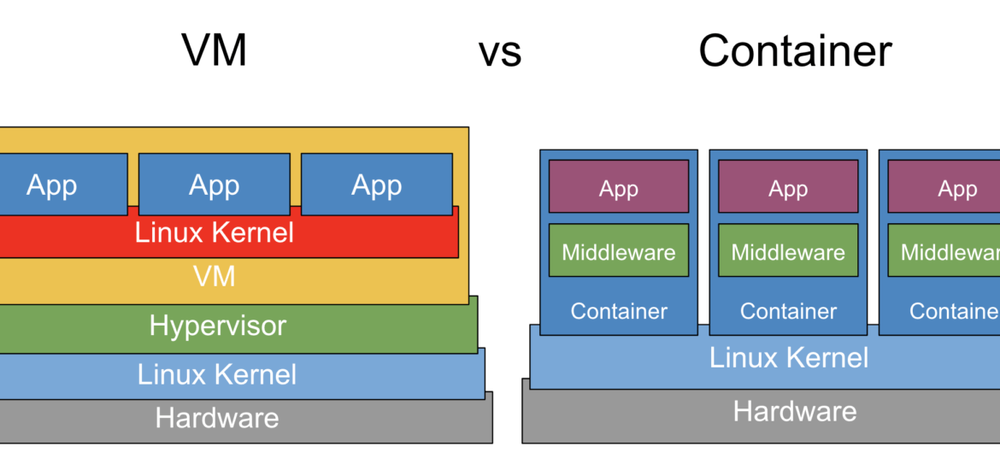

# Docker
## Konténer vs. virtuális gép
### Osztott kernel
A vagrantos jegyzetben már beszéltünk a VM-ekről, így ezekre most külön nem térünk ki. A konténerek esetén lényeges különbség, hogy a host OS kernele kerül megosztásra a guest rendszerrel. A hosttól történő izolációt maga a kernel oldja meg különböző szoftveres trükkökkel. <br>
<br>
<small>(Forrás: https://d1bbu1rz26yvjt.cloudfront.net/wp-content/uploads/2020/01/13200917/vm_vs_container-1170x550.png)</small><br>
Ebből következik, hogy a konténerben csak olyan OS futhat ami a host rendszer kernele meg tud hajtani. Tehát egy Debian host futtathat RPM alapú Linux konténereket is, hiszen a kernelük egyezik.

### Minimal OS & distroless konténer
Az __általunk tárgyalt Dockert használó konténerek__ nem teljesértékű operációs rendszereket tartalmaznak. Csak a legminimálisabb dolgokat tartalmazzák, melyek az adott szerver vagy alkalmazás futtatásához szükségesek.

## Komponensek
### Docker hálózat
A kurzus során a birdge hálózat típust fogjuk használni. Ez azt jelenti, hogy a konténerek egy virtuális, szeparált hálózathoz kapcsolódnak. A dockerrel fogjuk szabályozni, hogy az egyes konténerek portjai a host gép mely portjaira továbbítódjanak. Ezen a porton lehet majd elérni azokat akár a hostról akár a hálózatról.

### Volume
A konténerek fontos tulajdonsága, hogy könnyen eldobhatóak és újra létrehozhatóak. Azonban amikor nem stateless egy konténer, például adatbázist futtatunk benne, akkor valahogy az adatoknak **túl kell élni a konténer lecserélését**. Erre a volume a megoldás. Kijelölünk egy fájlt vagy mappát a konténerben és egy docker volumera kötjük. Ekkor ez a fájl vagy mappa a konténer által izolált területen kívülre kerül a host gépen és így megmarad a konténer megszűnése után is.

### Secret
Ha biztonságosan szeretnénk tárolni jelszavakat vagy kulcsokat a Dockerben, valamint ezeket fel szeretnénk használni egy-egy konténerben, akkor secret objektumokat definiálunk. Ezek titkosítva tárolják az adatokat, a konténerbe pedig titkosítatlan szöveges fájl formájában teszik elérhetővé ezeket.

### Image
A konténerek Docker imageből indulnak ki és ezekre építkezünk. Egy Docker fileban miután megjelöltük a kiinduló állapotot, különböző shell parancsokkal konfiguráljuk az általunk aztán buildelt imaget. A konténer ezt az buildet imaget klónozza és futtatja, példányosítja ha úgy tetszik. Természetesen vannak előre elkészített imagek, melyekre nem építkezünk hanem csak futtatjuk. Ilyenek például az adatbázisok, CMS rendszerek, Cloud drive alkalmazások... stb. 

### Folyamat
- Létrehozunk egy Dockerfilet és a kiindulási alapot addig módosítjuk míg az általunk futtatni kívánt kódot végre nem hajtja indításkor.
- Ezt a fájlt buildeljük. A ___verzió___ jelölés hivatalos angol neve a ___tag___, viszont így érthetőbb a funkciója.
```
docker build -t ___image_neve:verzio___ .
```
- Futtatjuk ezt az imaget.
```
docker run -d --name ___kontener_neve___ ___image_neve:verzio___
```

## Docker Compose
Tekinthetjük a Docker egyfajta Vagrantfilejának. Egy összegző, YML mely a konténeres infrastruktúra összes elemét leírja. Definiálunk benne konténereket, port nyitásokat, volumeokat és hálózatokat. Egy fájlal kezelhetővé válik így több dockeres elem.<br>
Compose fájl futtatása:
```
docker compose -f compose-file.yml up -d
```
<br>
Compose fájl leállítása (a volumeokat és secreteket nem törli):
```
docker compose -f compose-file.yml down
```

## Swarm
Több szerver klaszterbe kötésére a Docker swarm szolgál. Ilyenkor a rendszer automatikusan osztja el a rendelkezésre álló erőforrások közt a konténerek futtatását.